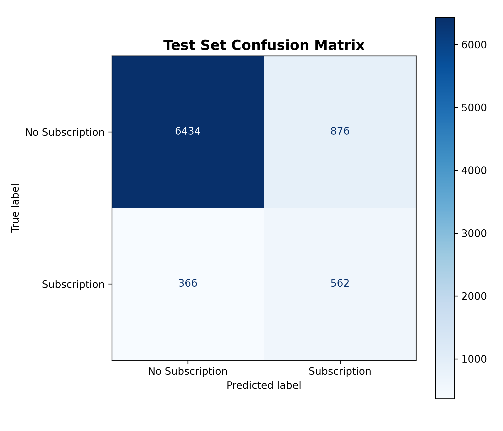
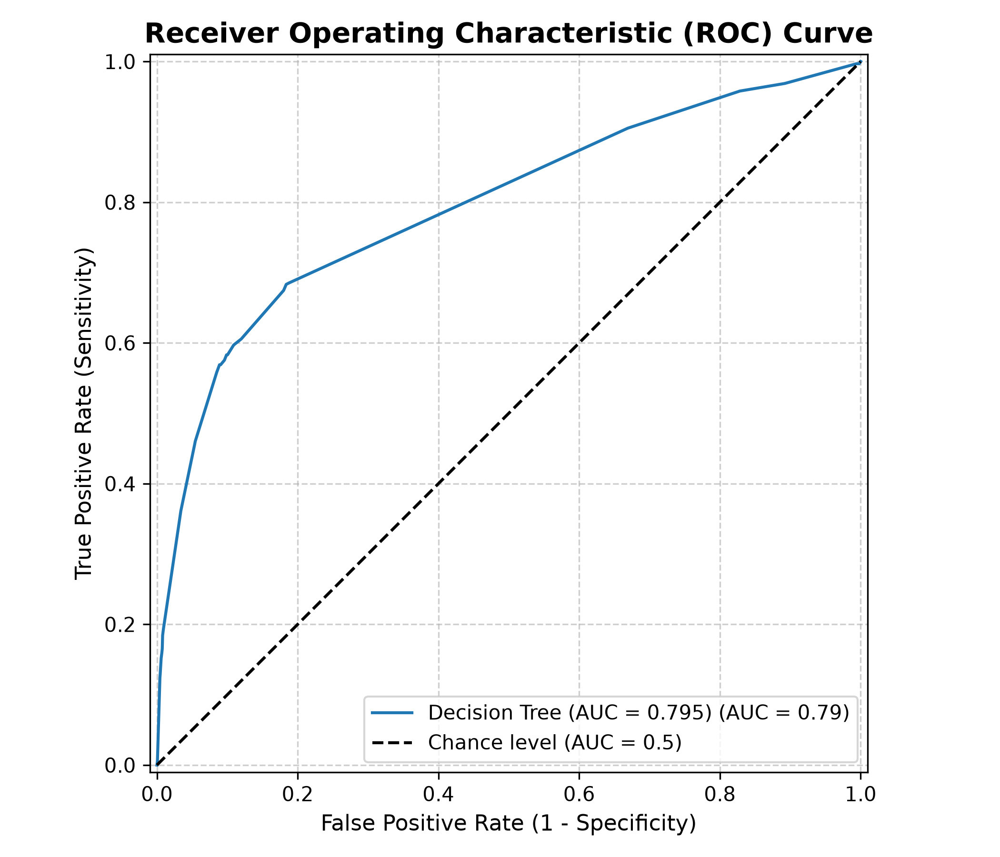

    # PRODIGY_DS_03: Bank Marketing Decision Tree Classifier

    This repository contains an end-to-end machine learning pipeline that builds, tunes, and evaluates a **Decision Tree Classifier** to predict whether a client will subscribe to a term deposit based on direct marketing campaign data.

    ---

    ## 📌 Project Overview

    - **Dataset**: Bank Marketing Dataset (`bank-additional-full.csv`)
    - **Objective**: Build a decision tree predictive model for client term deposit subscription.
    - **Evaluation Artifacts**:
    - Confusion Matrix plot (`images/confusion_matrix.png`)
    - ROC-AUC Curve plot (`images/roc_curve.png`)
    - Decision Tree Structure (`images/tree_structure.png`)

    ---

    ## 📁 Repository Structure

    ```text
    PRODIGY_DS_03/
    ├── data/
    │   └── bank-additional-full.csv
    ├── images/
    │   ├── confusion_matrix.png
    │   ├── roc_curve.png
    │   └── tree_structure.png
    ├── models/
    │   └── best_decision_tree.joblib
    ├── notebooks/
    │   ├── confusion_matrix.py
    │   ├── roc_curve.py
    │   └── tree.py
    ├── src/
    │   ├── preprocessing.py
    │   ├── train.py
    │   └── evaluate.py
    ├── config.py
    ├── requirements.txt
    └── README.md

    ## 📊 Model Evaluation & Diagnostic Insights

### 1. Confusion Matrix
The confusion matrix evaluates classification performance on the unseen test set by comparing actual subscription outcomes against predicted labels:

- **True Positives (TP) & True Negatives (TN)**: Quantify correct predictions for both subscribers (`yes`) and non-subscribers (`no`).
- **False Positives (FP) & False Negatives (FN)**: Highlight misclassifications, showing campaign outreach efficiency versus missed opportunity cost for potential depositors.



---

### 2. Receiver Operating Characteristic (ROC) Curve
The ROC curve illustrates the trade-off between sensitivity and specificity across varying probability classification thresholds:

- **True Positive Rate (Sensitivity)**: Measures the proportion of actual subscribers correctly identified by the tree model.
- **False Positive Rate (1 - Specificity)**: Tracks non-subscribers incorrectly targeted as potential depositors.
- **AUC (Area Under the Curve)**: Reflects the overall ranking ability of the classifier—a higher AUC score indicates better discrimination between potential subscribers and non-subscribers compared to a baseline random guess (AUC = 0.50).

